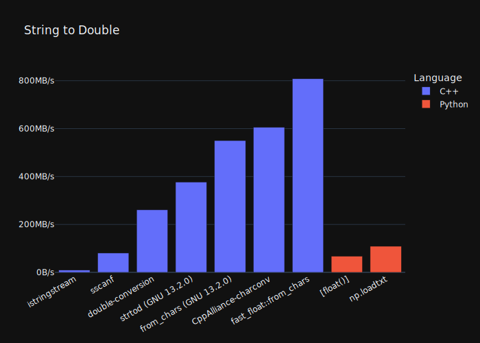

Benchmark different approaches to parsing scientific datafiles.

## Parse Bench

C++ IO Streams are often the go-to implementation choice. While easy to use and very featureful, iostream throughput is terrible.

Benchmarks in this repo measure throughput of several approaches for each of several parsing steps to show the performance impact of each approach:
 * **Scan**: a simple iteration reading each byte. Shows the roofline performance supported by the memory subsystem.
 * **Newline detection**: A scan that finds newlines. Show the performance hit of testing characters.
 * **Line tokenization**: A scan that also splits each line into fields based on whitespace.
 * **Parse integers**: Test approaches to parsing integers.
 * **Parse double**: Test approaches to parsing floating point numbers.
 * **Parse block**: Use lessons learned to write a parser that can parse a simple datafile.

The datafile lines we test contain two integers and a double. Of course other schemas will show different performance, but this provides good ballpark figures.

Parsing methods do not attempt to cheat by skipping error checking (where possible) as a real parser will have to perform error checking.

## Results

The benchmarks are run using Google Benchmark. The default settings emit a table that shows throughput in bytes per second.

The core result is bytes per second for each approach. That is the only figure shared by all the different steps, and the most useful figure to estimate how long a parser will take to parse a file.

We use short and long fields to attempt to not cherry-pick easy or hard inputs. See [main.cpp](main.cpp) for what the input data looks like.

See [plots](plots/plot.ipynb) for a Jupyter notebook that reads the Google Benchmark output and plots relevant results. The provided results were run on an M1 Macbook Pro.




## Takeaways

* Datafile parse performance is CPU bound due to parsing, not IO bound. By a lot.
* IO Streams are very slow, about 5x slower than a mechanical hard drive, and get slower when used in parallel.
* A fast approach includes using fast methods to identify fields then use fast field conversion methods to parse said fields.
* C routines like `strtoll` and `strtod` are usable (sequentially only).
* The C++17 `std::from_chars` methods are *fast*. The float version has [spotty compiler support](https://en.cppreference.com/w/cpp/compiler_support/17), use [fast_float](https://github.com/fastfloat/fast_float).
* Avoid scanf. Slow, gets slower when used in parallel, poor error checking.
* Parallelism: an efficient parallel parser can reach >1 GB/s speeds on a laptop.
* Parallelism: standard library methods lock internally (on the locale). This kills parallel performance. Examples: `istringstream`, `strtod`, `scanf`, etc.

## Parallelism

CPU-bound operations have a natural path to speedup: parallelism. We include some parallel parsing here, with many simplifying (but realistic) assumptions to focus on speeding up parsing only.

All parallel tests included here are embarassingly parallel. All threads have their own unique inputs and nothing is shared between threads (at least at the application level, see note below).

Some methods that are good options for single-threaded use are either not thread safe or include internal synchronization that kills multithreaded performance.
For example, using `strtod` in parallel is *slower* than single threaded, at least on some platforms. The problem appears to be locale support which requires locking. Some platforms like BSD and macOS include a `strtod_l` which can avoid this, but it is not portable.

# Run on Your Own System

Building and running the benchmarks is fully automated. Just run:

```shell
./run_all_benchmarks.sh
```

Which will write benchmark output to the console and a JSON version to `plots/benchmark_outputs/`. This will not overwrite anything.

Then open the [`plots/plot.ipynb`](plots/plot.ipynb) notebook in Jupyter and run all the cells to see the plots with data from your system.

This will install and open Jupyter (in a virtual env) for you:
```shell
cd plots/
./start_jupyter.sh
```
Then select "Cells" -> "Run All".

### macOS
The version of clang bundled with macOS does not support OpenMP. Parallel benchmarks are disabled if OpenMP is not found.

Install Homebrew's LLVM and this project's `cpp/run.sh` will pick it up.
```shell
brew install llvm
```

You can also try to install OpenMP with `brew install libomp`. That works sometimes. 